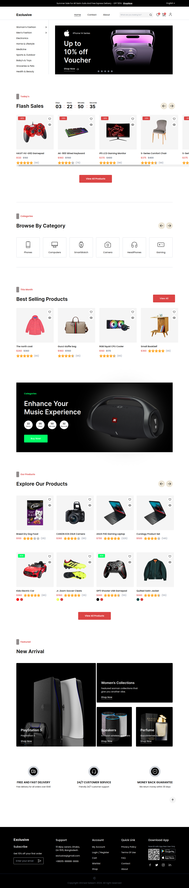

# E-commerce - react app

This is a fullstack project using react and firebase

## Table of contents

- [Overview](#overview)
  - [The challenge](#the-challenge)
  - [Screenshot](#screenshot)
  - [Links](#links)
- [My process](#my-process)
  - [Built with](#built-with)
  - [What I learned](#what-i-learned)
  - [Continued development](#continued-development)
- [Author](#author)

## Overview

### The challenge

Users should be able to:

- sign up and login to save the user data
- Toggle pages smoothly
- Browse the products
- Add preferred products to the wishlist
- Add the products to the cart
- delete unwanted products from the wishlist and cart
- view specific product
- Buy the product in the cart with its amount
- change to the preferred language

### Screenshot

### Links

- Solution URL: [E-commerce repo](https://github.com/Ahmed-Seleem01/e-commerce-react)
- Live Site URL: [E-commerce live page](https://e-commerce-react-pied.vercel.app/)

## My process

### Built with

- Semantic HTML5 markup
- react
- firbase
- react-router
- tailwind

### What I learned

I have learned in this project to how to build an app with react, using react router to take the
advantage of the client routing and dealing with firebase and how to link the app with the firebase
and deal with its APIs.

### Continued development

I now work on the performance and how to make the app more faster.

## Author

- Linkedin - [Ahmed Seleem](hwww.linkedin.com/in/ahmedseleem1)
